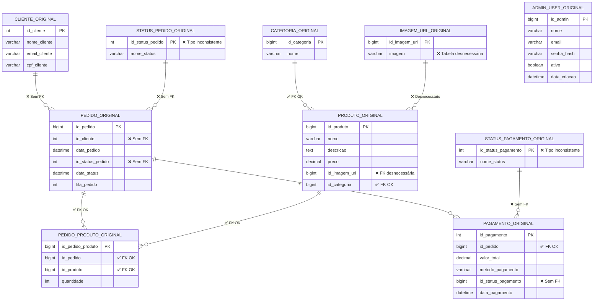
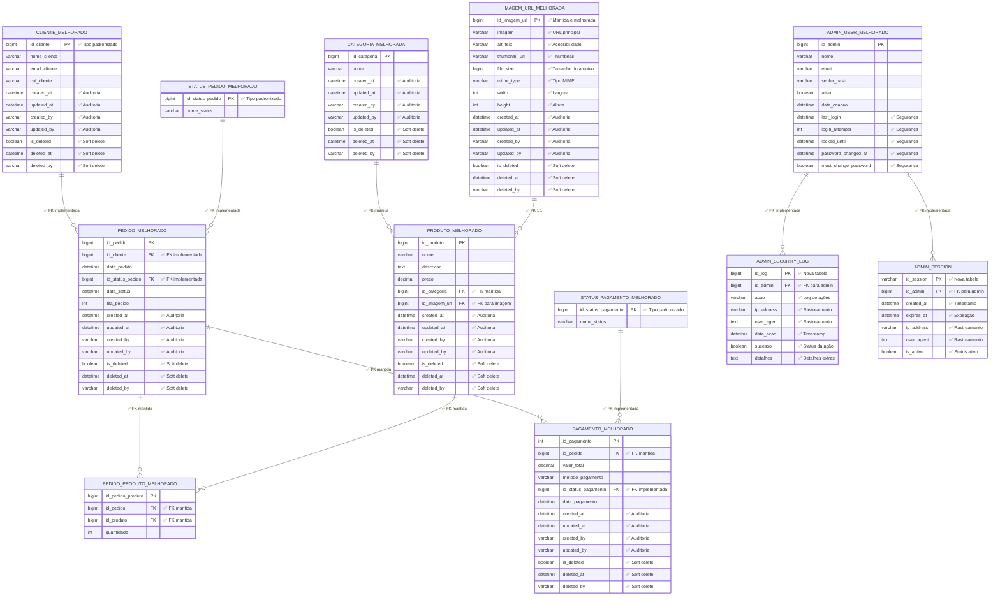

# Diagrama Comparativo - Evolução do Banco de Dados

## Requisitos

Para visualizar o diagrama, deve ter a extensão: bierner.markdown-mermaid

---

## Estrutura original

---

## Estrutura melhorada

