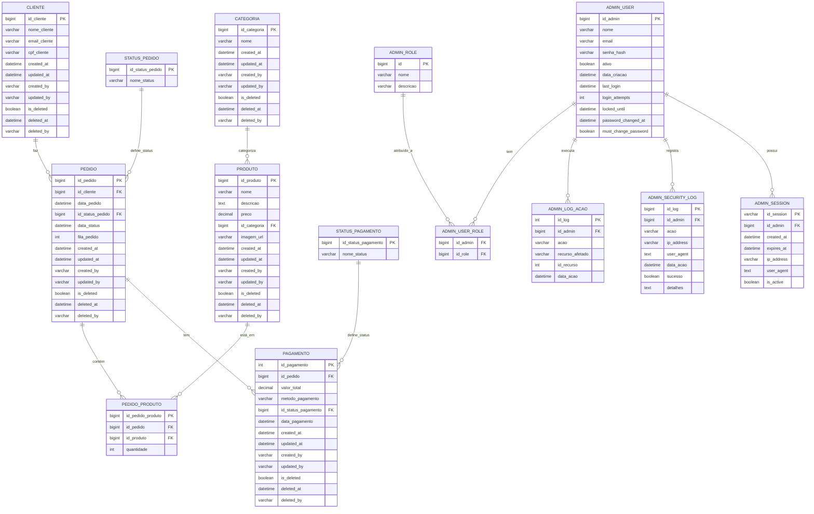

# Diagrama da Estrutura Melhorada do Banco de Dados

## Requisitos

Para visualizar o diagrama, deve ter a extensão: bierner.markdown-mermaid

## Modelo Entidade-Relacionamento (ER) - Estrutura melhorada

